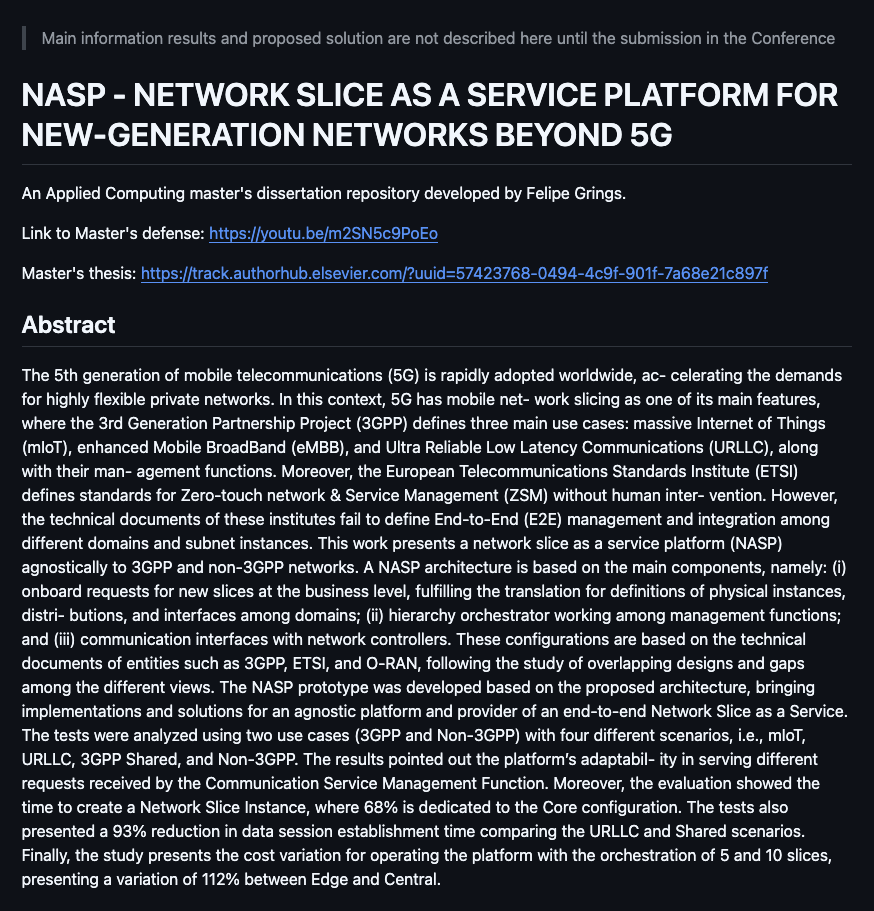
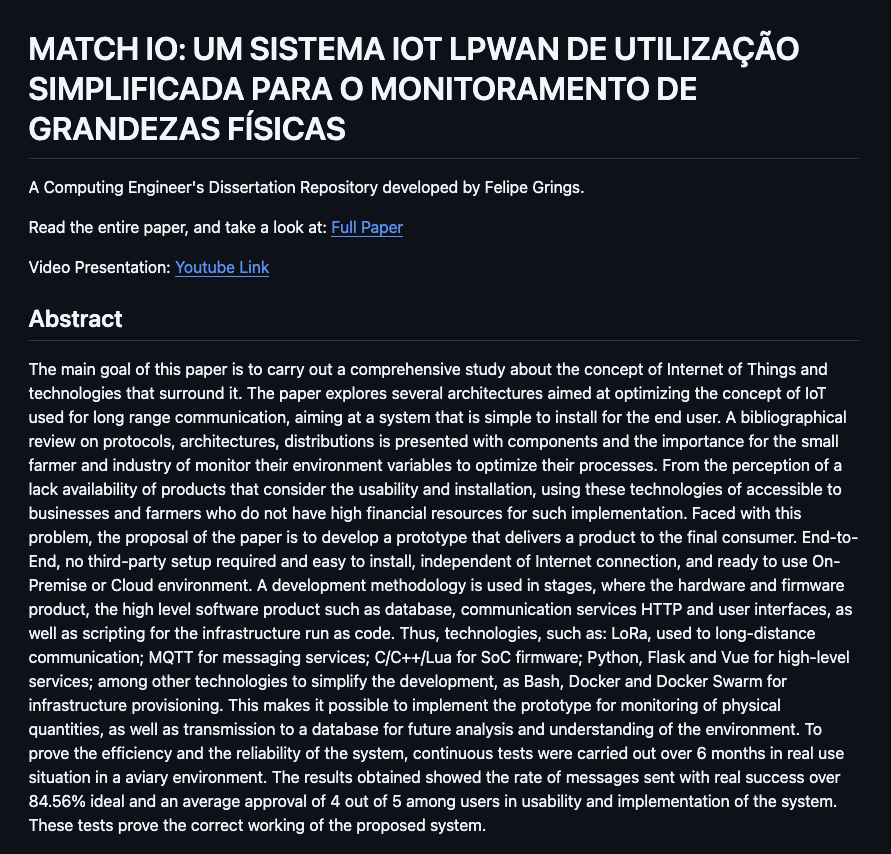

# Welcome to Felipe Grings GitHub.

**Infrastructure Delivery | DevOps Engineer**

<a href="https://github.com/fhgrings/NASP">Master in Applied Computing - Beyound 5G Core Network Slicing</a>

<a href="https://github.com/fhgrings/match-io">Computer Engineer Final Work - Universidade do Vale do Rio do  Sinos</a>

### What I'am studying?

#### Mainly

* Linux    - https://github.com/fhgrings/Linux
* Internet of Things - Computing Engineer Conclusion Work - https://github.com/fhgrings/match-io
* DevOps
  * Free5GC K8s AWS Provisioning - https://github.com/fhgrings/5g-core-network-slicing
  * Gitlab       - https://github.com/fhgrings/GitLab-CI-CD
  * Ansible      - https://github.com/fhgrings/Ansible-Playground
  * Jenkins      - https://github.com/fhgrings/Jenkins-Playground
  * Docker       - https://github.com/fhgrings/Docker-Playground 
  * TCPDump      - https://github.com/fhgrings/wireshark-playground
  * AWS AWS Certified SysOps Administrator - 
* Shell    - https://github.com/fhgrings/Shell-Playground

#### Telecom - 5G/6G
  * Network Slice 5G Core on k8s cluster  - https://github.com/fhgrings/FDO-5gc

#### For Fun

* Artificial Intelligence - https://github.com/fhgrings/IA-Playground
* Computer Vision         - https://github.com/fhgrings/Python-Playground/tree/master/image-processing
* Software Architechture  - https://github.com/fhgrings/Cloud-Native

### Certificates

* SCRUM FCO
* GitLab Associete
* Digital Prototyping Designer
* Embedded Systems Designer
* Fundamental Electronics Designer
* Software Development Fundamentals